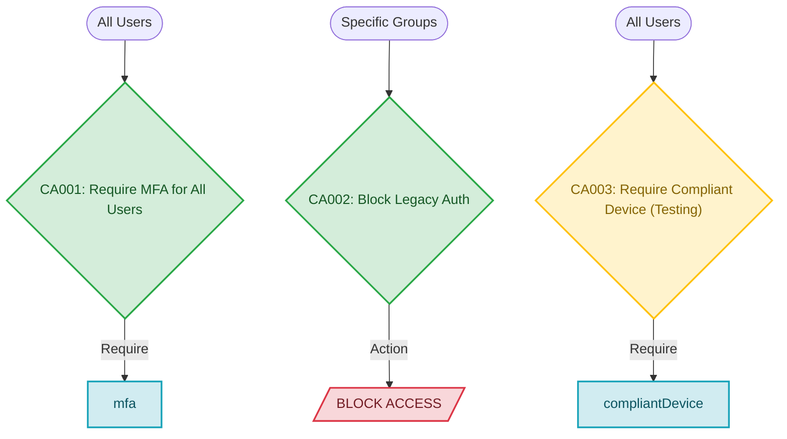

🛡️ Entra ID Conditional Access Visualizer

An automated PowerShell tool that pulls Microsoft Entra Conditional Access (CA) Policies via the Microsoft Graph API and transforms them into clean, rendered Mermaid.js architecture diagrams inside native Markdown.

Eliminate manual policy documentation and stale architecture diagrams with code-driven visual documentation.

⸻

🎨 Visual Preview

GitHub natively renders Mermaid markup generated by this script into interactive flowcharts:

✨ Features

* Zero External Diagram Dependencies: Uses native Markdown and Mermaid.js—no Visio, Lucidchart, or third-party image generation required.
* State-Aware Styling: Color-coded node system distinguishes Enabled (Green), Report-Only (Yellow), and Explicit Block (Red) policies at a glance.
* Sanitized String Mapping: Escapes special characters and formats Graph API output to prevent Mermaid rendering syntax errors.
* Auditor-Friendly: Generates automated Markdown timestamp headers and policy counters for compliance reporting.

📋 Prerequisites & Permissions

Required PowerShell Modules

* Microsoft.Graph.Identity.SignIns (v2.0+)

Install the required module using PowerShell:

Install-Module Microsoft.Graph.Identity.SignIns -Scope CurrentUser -Repository PSGallery -Force

Required Entra ID Permissions

To query CA policies, your authenticated account or Service Principal needs at least one of the following permissions:

Permission Name	Type	Description
Policy.Read.All	Delegated / Application	Allows reading all Conditional Access policies
Policy.Read.ConditionalAccess	Delegated / Application	Least-privilege permission specifically for CA policies

🚀 Quick Start

1. Clone the repository:

git clone https://github.com/your-username/Entra-CA-Visualizer.git
cd Entra-CA-Visualizer

2. Run the script:

.\Export-CAPoliciesToMermaid.ps1 -OutputPath ".\docs\CAPolicies.md"

3. View the results:
    Open ./docs/CAPolicies.md in GitHub, VS Code (with Markdown Preview), or any Mermaid-compatible editor to see your live diagram.

📂 Repository Structure

Entra-CA-Visualizer/
├── .github/
│   └── workflows/
│       └── generate-diagram.yml   # (Optional) CI/CD schedule for auto-updates
├── docs/
│   └── CAPolicies.md              # Auto-generated documentation output
├── Export-CAPoliciesToMermaid.ps1 # Main PowerShell script
├── LICENSE                        # MIT License
└── README.md                      # Project documentation

⚙️ Script Parameters

Parameter	Type	Default	Description
-OutputPath	[string]	".\CAPolicies.md"	The target Markdown file location for the Mermaid output.

🛡️ Security & Best Practices

* Read-Only Scope: The script only requests read access (Policy.Read.All). It makes no modifications to your tenant configuration.
* No Stored Credentials: Uses native Connect-MgGraph interactive authentication by default. For CI/CD automations, leverage Workload Identity Federation or environment secrets rather than hardcoded credentials.

🤝 Contributing

Contributions are welcome! If you’d like to extend the script to map conditions (e.g., Device Platforms, Locations, or Risk Levels), feel free to fork the repo and submit a Pull Request.

1. Fork the Project
2. Create your Feature Branch (git checkout -b feature/AddLocationMapping)
3. Commit your Changes (git commit -m 'Add location condition parsing')
4. Push to the Branch (git push origin feature/AddLocationMapping)
5. Open a Pull Request

📄 License

Distributed under the MIT License. See LICENSE for details.